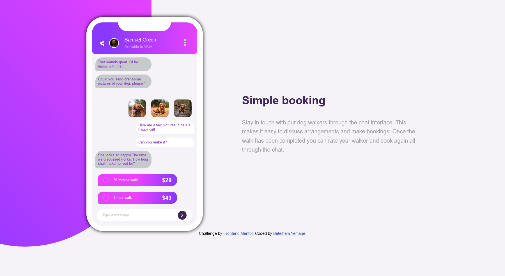

# Frontend Mentor - Chat app CSS illustration solution

This is a solution to the [Chat app CSS illustration challenge on Frontend Mentor](https://www.frontendmentor.io/challenges/chat-app-css-illustration-O5auMkFqY). Frontend Mentor challenges help you improve your coding skills by building realistic projects. 

## Table of contents

- [Overview](#overview)
  - [The challenge](#the-challenge)
  - [Screenshot](#screenshot)
  - [Links](#links)
- [My process](#my-process)
  - [Built with](#built-with)
  - [What I learned](#what-i-learned)
- [Author](#author)
- [Acknowledgments](#acknowledgments)

## Overview

### The challenge

Users should be able to:

- View the optimal layout for the component depending on their device's screen size
- **Bonus**: See the chat interface animate on the initial load

### Screenshot



### Links

- Solution URL: https://github.com/ManaIsrael/chat-app-illustration
- Live Site URL: https://github.com/ManaIsrael/chat-app-illustration

## My process

### Built with

- Flexbox

### What I learned
```.arrow {
      width: 5px;
      height: 5px;
      border: 2px solid var(--secondary-white);
      transform: rotate(-45deg);
      border-top: transparent;
      border-left: transparent;
   }
```

## Author

- Frontend Mentor - [@manaisrael](https://www.frontendmentor.io/profile/manaisrael)
- Twitter - [@betelhemyemane3](https://www.twitter.com/betelhemyemane3)

## Acknowledgments

I Always Love to Acknowledge Mother of God Saint Virgin Mary, I wouldn't even know what my passion and luck is if I hadn't prayed unto her. Next I would Love to acknowledge my Mother Sara fekadu who encouraged me to keep up with my passion, without her advice, I wouldn't be here doing web development rather I would only just care about my GPAs.
